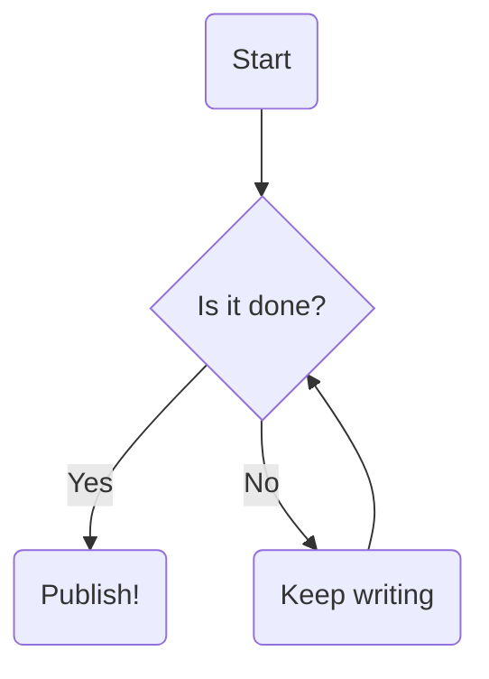

Today I learned about [Mermaid](https://mermaid.ai/open-source/?utm_medium=hero&utm_campaign=variant_a&utm_source=mermaid_js), which lets you make diagrams in Markdown! You just make a code block with the type `mermaid` and then there are several different types of charts you can make. Super useful for throwing a quick chart together. However, in order for this to work on my site (which doesn't natively support it unlike the VS Code Markdown preview), I need to create a Markdown Render Hook. That means creating `layouts/_default/_markup/render-codeblock-mermaid-.html` (create that dir since it doesn't exist yet, and the file name is very specific). This loads Mermaid.js from the jsdelivr CDN and makes sure it only loads once.

Then, the code to load is:
```html
<pre class="mermaid">
  {{- .Inner | safeHTML -}}
</pre>

{{ if not (.Page.Store.Get "mermaid_loaded") }}
  {{ .Page.Store.Set "mermaid_loaded" true }}
  <script type="module">
    import mermaid from 'https://jsdelivr.net';
    mermaid.initialize({ startOnLoad: true });
  </script>
{{ end }}
```

And now we should be able to render the graph!


