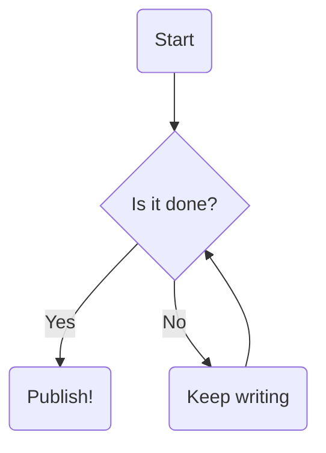

Today I learned about [Mermaid](https://mermaid.ai/open-source/?utm_medium=hero&utm_campaign=variant_a&utm_source=mermaid_js), which lets you make diagrams in Markdown! You just make a code block with the type `mermaid` and then there are several different types of charts you can make. Super useful for throwing a quick chart together.

