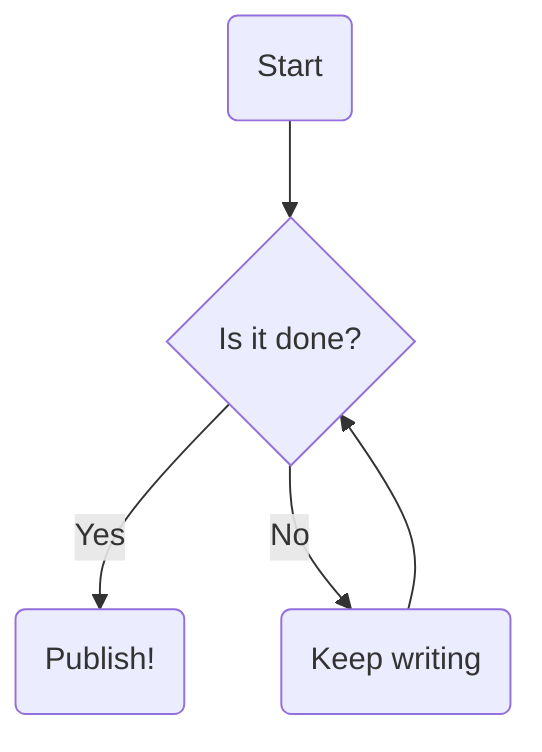

Today I learned about [Mermaid](https://mermaid.ai/open-source/?utm_medium=hero&utm_campaign=variant_a&utm_source=mermaid_js), which lets you make diagrams in Markdown! You just make a code block with the type `mermaid` and then there are several different types of charts you can make. Super useful for throwing a quick chart together. However, in order for this to work on my site (which doesn't natively support it unlike the VS Code Markdown preview), I need to create a Markdown Render Hook. That means creating `layouts/_default/_markup/render-codeblock-mermaid.html` (create that dir since it doesn't exist yet, and the file name is very specific). This loads Mermaid.js from the jsdelivr CDN and makes sure it only loads once. I also need to check the blog theme to match light/dark mode.

Then, the code to load is:
```html
<pre class="mermaid">
  {{- .Inner | safeHTML -}}
</pre>

{{ if not (.Page.Store.Get "mermaid_loaded") }}
  {{ .Page.Store.Set "mermaid_loaded" true }}
  <script type="module">
    import mermaid from 'https://cdn.jsdelivr.net/npm/mermaid@12/dist/mermaid.esm.min.mjs';

    // 1. Check the data-theme attribute on the <html> tag
    function getMermaidTheme() {
      const currentTheme = document.documentElement.getAttribute('data-theme');
      return currentTheme === 'dark' ? 'dark' : 'default';
    }

    // 2. Initialize Mermaid with the correct theme on page load
    mermaid.initialize({ 
      startOnLoad: true,
      theme: getMermaidTheme()
    });

    // 3. Watch for changes to the data-theme attribute (for live toggles)
    const observer = new MutationObserver(() => {
      // Re-initialize and force a re-render when the toggle is clicked
      mermaid.initialize({ theme: getMermaidTheme() });
      mermaid.run();
    });

    observer.observe(document.documentElement, { 
      attributes: true, 
      attributeFilter: ['data-theme'] 
    });
  </script>
{{ end }}

```

And now we should be able to render the graph! I could make it so that it dynamically change with the dark mode toggle, but this is already getting pretty involved for what is supposed to be a quick demo.


